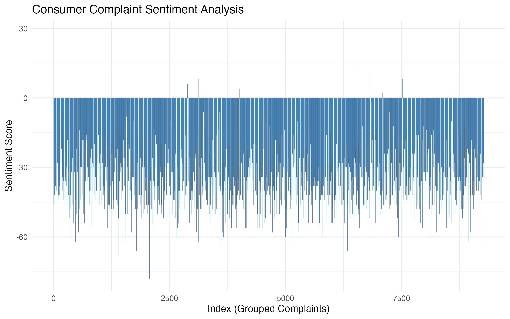
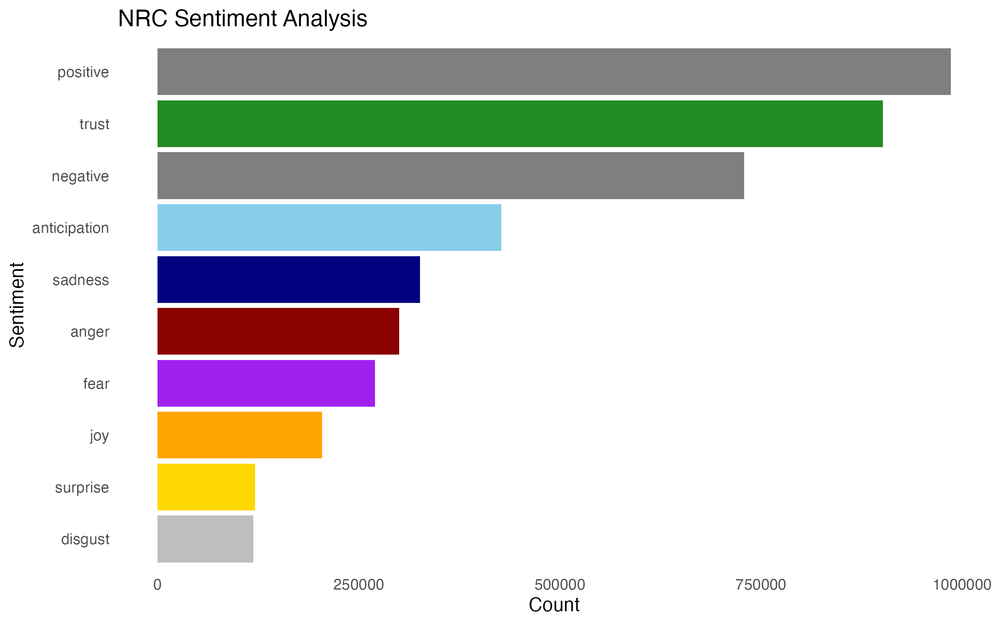

# Consumer Complaints Sentiment Text Analysis

## Author
- Kritan Shrestha

## Introduction 📌
This project analyzes consumer complaints through text analysis techniques, including word cloud visualization and sentiment analysis using Bing and NRC lexicons. The goal is to uncover common themes, sentiment trends, and emotional tones in consumer complaints to derive actionable insights.

---

## Data Dictionary
The dataset consists of consumer complaints from various industries.  
### Columns Used:
1. **Consumer.complaint.narrative** – The raw text of consumer complaints.

---

## Data Cleaning
The raw data underwent the following preprocessing steps to ensure consistency and relevance:  
1. **Removed missing values** –Removed rows with missing or empty complaint narratives.  
```r
df_clean <- df %>% 
  filter(!is.na(Consumer.complaint.narrative) & Consumer.complaint.narrative != "")
```

2. **Text Standardization** – Removed punctuation, numbers and trimmed extra whitespace. 
```r
df_clean$Consumer.complaint.narrative <- df_clean$Consumer.complaint.narrative %>% 
  str_replace_all("[[:punct:]]", "") %>%  
  str_replace_all("[[:digit:]]", "") %>%  
  str_squish()
```

3. **Removed stopwords** – Eliminated common English stopwords (e.g., "the", "and").
```r
df_clean <- df_clean %>% 
  mutate(Consumer.complaint.narrative = removeWords(Consumer.complaint.narrative, stop_words$word))
```

4. **Tokenization** – Split complaints into individual words for analysis.
```r
df_tokens <- df_clean %>% 
  unnest_tokens(word, Consumer.complaint.narrative)
```

5. **Filtered unwanted placeholders: Removed placeholder terms like "XXXX".)**.
```r
df_tokens <- df_tokens %>% 
  filter(!str_detect(word, "^x+$"))
```
---

## Data Analysis
### 1. **Word Cloud**

<div align="center">

</div>

#### **Why This Chart?**
The word cloud highlights the most frequent terms in consumer complaints. Larger words indicate higher frequency, providing a quick visual summary of common issues (e.g., "credit", "account", "payment").

```r
wordcloud(words = df_wordcloud$word, min.freq = 50, max.words = 200, 
          colors = brewer.pal(8, "Dark2"), scale = c(3, 0.5))
```

### 2. **Bing Sentiment Analysis**

<div align="center">

</div>

#### **Why This Chart?**
The Bing lexicon categorizes words into positive/negative sentiments. This line chart tracks sentiment scores across grouped complaints, showing how positivity or negativity trends over time.

**Methodology:**
- pivot_wider reshaped the data to calculate sentiment scores (positive - negative).

- Scores are aggregated every 80 complaints to smooth short-term fluctuations.

```r
sentiment_bing_score <- df_bing %>% 
  inner_join(get_sentiments("bing")) %>%
  mutate(index = row_number() %/% 80) %>%
  count(index, sentiment) %>%
  pivot_wider(names_from = sentiment, values_from = n, values_fill = 0) %>% 
  mutate(sentiment_score = positive - negative)
```

### 3. **NRC Sentiment Analysis**

<div align="center">

</div>

#### **Why This Chart?**
The NRC lexicon categorizes text into emotions (e.g., "anger", "trust", "fear"). This bar chart reveals the emotional tone of complaints.

**Insight:**
High "anger" or "fear" counts may indicate urgent issues, while "trust" could reflect positive resolutions.

```r
sentiment_nrc <- df_nrc %>% 
  inner_join(get_sentiments("nrc")) %>% 
  count(sentiment, sort = TRUE)
```

---

## Conclusion
1. **Word Cloud:** Frequent terms like "credit" and "payment" suggest financial service issues dominate complaints.

2. **Bing Analysis:** Sentiment scores vary significantly, indicating fluctuating consumer satisfaction.

3. **NRC Analysis:** High "anger" and "fear" counts highlight areas needing urgent intervention.

----

## Execution
1. Get 'consumer_complaints.csv.zip' from the google drive link 'https://drive.google.com/file/d/1Iz_VFDZZjpMsLMt4eIO24ItJy57ZQM51/view?usp=sharing'  
2. Run 'cleaned_data.R' to preprocess raw data. 
3. Execute `wordcloud.R`, `bing.R`, and `nrc.R` in any order to generate visualizations.

## Methodology
- **Bing Lexicon**: Focuses on binary sentiment (positive/negative) for trend analysis.
- **NRC Lexicon**: Captures nuanced emotions (e.g., "anger", "trust") to identify urgent issues.
- **Word Cloud**: Prioritizes frequency over sentiment to highlight dominant complaint topics.

---
