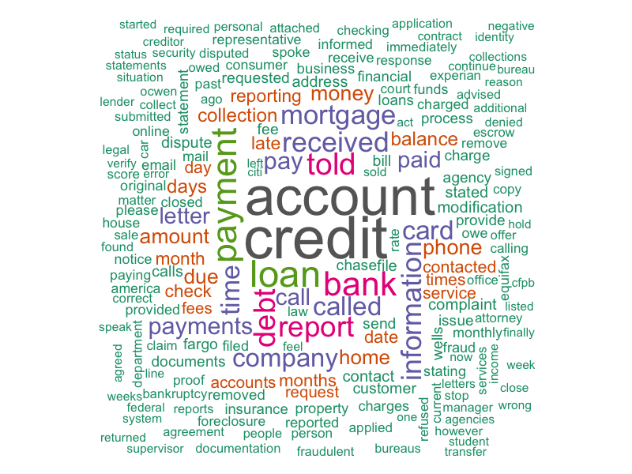

# Consumer Complaints Sentiment Text Analysis

## Author
- Kritan Shrestha

## Introduction 📌
This project analyzes consumer complaint narratives using **text mining and sentiment analysis**.  
We use **Bing and NRC sentiment lexicons** to extract consumer sentiment and generate insights.  

<div align="center">

</div>

---

## Data Dictionary
The dataset consists of consumer complaints from various industries.  
### Columns Used:
1. **Consumer.complaint.narrative** – The raw text of consumer complaints.

---

## Data Cleaning
We cleaned the data to ensure accurate analysis:
1. **Removed missing values** – Ensured only complaints with text are used.
2. **Lowercased text & removed punctuation** – Standardized format.
3. **Removed stopwords** – Focused on meaningful words.
4. **Tokenized text** – Broke complaints into individual words.
5. **Filtered unwanted placeholders (e.g., "XXXX")**.

```r
df_clean <- df %>% 
  filter(!is.na(Consumer.complaint.narrative) & Consumer.complaint.narrative != "") %>% 
  select(Consumer.complaint.narrative)


